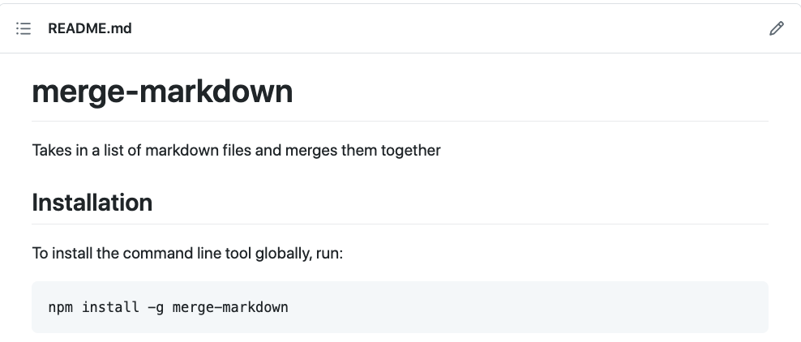

# Lorem Ipsum One

Lorem ipsum dolor sit amet, consectetur adipiscing elit. Curabitur egestas dapibus ex, vel ultrices dui posuere id. In eget vehicula augue, et porttitor justo. Curabitur id vehicula enim. Pellentesque finibus lacus vitae magna aliquam, vitae vulputate nibh molestie. Aliquam ut augue nisi. Vivamus in mauris volutpat, pellentesque orci ultrices, sagittis libero. Proin volutpat enim lorem, a accumsan diam tempor eget. Nunc sed neque sed augue imperdiet ultrices vitae a mi. Suspendisse ultricies arcu at est convallis, ut vehicula felis tincidunt. Nulla facilisi.


*WKND SPA Implementation*

<!-- START doctoc -->
<!-- END doctoc -->

[...back to main TOC](#course-contents)

#### About

Lorem ipsum dolor sit amet, consectetur adipiscing elit.[^o-1] Integer et ullamcorper ipsum, in efficitur mi. Ut vitae velit et orci eleifend elementum. Sed vestibulum tortor lacus, eu aliquet velit luctus fermentum. Suspendisse non sapien nec arcu volutpat accumsan vehicula eget mi. Interdum et malesuada fames ac ante ipsum primis in faucibus. Donec sit amet finibus diam. Vivamus malesuada eu massa pulvinar viverra. Aliquam accumsan ultrices ornare. Etiam sed elementum odio.


* [Lorem](https://www.lipsum.com/)
* [Ipsum](https://www.lipsum.com/)
* [Merge Markdown](https://github.com/knennigtri/merge-markdown)
* [React JS](https://reactjs.org/)
* [Create React App](https://create-react-app.dev/)

#### Get the Code

Lorem ipsum dolor sit amet, consectetur adipiscing elit. Integer et ullamcorper ipsum, in efficitur mi. Ut vitae velit et orci eleifend elementum.

Lorem ipsum dolor sit amet, consectetur adipiscing elit. Integer et ullamcorper ipsum, in efficitur mi. Ut vitae velit et orci eleifend elementum.

#### Prerequisites

Before starting this guide, you'll need the following:

* A basic knowledge of HTML, CSS, and JavaScript
* Basic familiarity with [React](https://reactjs.org/tutorial/tutorial.html)
* [Node.js](https://nodejs.org/en/) and [npm](https://www.npmjs.com/)

#### Code  snippets

```xml
  <!-- Comment -->
    <xs:element name="name">
  <xs:complexType>
    <xs:sequence>
      <xs:element name="name">
        <xs:simpleType>
          <xs:restriction base="xs:string"></xs:restriction>
        </xs:simpleType>
      </xs:element>
    </xs:sequence>
  </xs:complexType>
</xs:element>
```

```shell
cat song.txt | more
```
